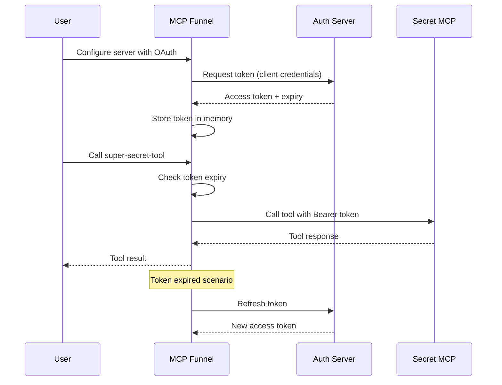

# MCP OAuth & SSE Transport - MVP Design

## External Specifications & References

### Required Reading
- **OAuth 2.0 Specification**: [RFC 6749](https://datatracker.ietf.org/doc/html/rfc6749) - Sections 4.4 (Client Credentials), 6 (Token Refresh)
- **MCP Specification**: [Model Context Protocol](https://spec.modelcontextprotocol.io/specification/) - Section on HTTP/SSE Transport
- **MCP SDK Documentation**: [@modelcontextprotocol/sdk v1.18.0](https://github.com/modelcontextprotocol/typescript-sdk)
- **Server-Sent Events**: [W3C EventSource Specification](https://html.spec.whatwg.org/multipage/server-sent-events.html)
- **JSON-RPC 2.0**: [Specification](https://www.jsonrpc.org/specification) for message format

### Dependencies
```json
{
  "@modelcontextprotocol/sdk": "^1.18.0",  // MCP SDK with Transport interface
  "eventsource": "^2.0.2",                  // Node.js EventSource polyfill
  "uuid": "^9.0.1",                         // Message correlation IDs
  "zod": "^3.22.4"                          // Schema validation
}
```

### Minimum Requirements
- **Node.js**: v18.0.0+ (native fetch API support)
- **TypeScript**: v5.0.0+
- **Environment**: Supports ES2022 modules

## Problem Statement

MCP Funnel currently only supports stdio transport for connecting to upstream MCP servers. This limits:
- Connection to remote/cloud-based MCP servers
- Authentication to secured MCP servers requiring OAuth2
- Enterprise use cases with centralized MCP services

The MCP specification defines OAuth2 authorization for HTTP-based transports using Server-Sent Events (SSE) for server-to-client communication and HTTP POST for client-to-server messages. MCP Funnel will implement this standard pattern.

## User Experience Flow

**Current limitation:**
```
User: "I want to connect to secret-mcp server over HTTPS with OAuth"
MCP Funnel: ❌ Not supported - only stdio transport available
```

**Enhanced flow with OAuth:**
```
User: Configures secret-mcp with OAuth credentials
MCP Funnel: Authenticates to secret-mcp using OAuth2
MCP Funnel: Obtains access token with proper audience validation
MCP Funnel: Routes tool calls with Bearer token authentication
User: Can use super-secret-tool transparently through MCP Funnel
```

## Configuration Design

### Backwards Compatible Structure

```json
{
  "servers": {
    // Legacy stdio configuration (unchanged)
    "github": {
      "command": "docker",
      "args": ["run", "ghcr.io/github/github-mcp-server"],
      "env": {
        "GITHUB_TOKEN": "${GITHUB_TOKEN}"
      }
    },

    // New SSE transport with OAuth
    "secret-mcp": {
      "transport": {
        "type": "sse",
        "url": "https://api.secret-provider.com/mcp",
        "auth": {
          "type": "oauth2-client",
          "clientId": "mcp-funnel-instance",
          "clientSecret": "${SECRET_MCP_CLIENT_SECRET}",
          "tokenEndpoint": "https://auth.secret-provider.com/oauth/token",
          "audience": "https://api.secret-provider.com",
          "scopes": ["tools:use", "data:read"]
        }
      }
    },

    // SSE with simple bearer token
    "api-service": {
      "transport": {
        "type": "sse",
        "url": "https://api.example.com/mcp",
        "auth": {
          "type": "bearer",
          "token": "${API_SERVICE_TOKEN}"
        }
      }
    }
  }
}
```

## Authentication Architecture

### Core Principles

1. **Separation of Auth Contexts**: MCP Funnel maintains separate authentication for each upstream server
2. **No Token Passthrough**: Never forward tokens from Claude to upstream servers (prevents confused deputy attacks)
3. **Audience Validation**: Each token is bound to specific resource server
4. **Secure Storage**: Credentials in environment variables, tokens in memory (MVP)

### Authentication Flow



## Transport Abstraction

### Transport Types

1. **StdioTransport** (current)
   - Local process spawning
   - Environment variable authentication
   - Stderr prefixing for logs

2. **SSETransport** (new - follows MCP SDK pattern)
   - Server-Sent Events for server→client messages
   - HTTP POST for client→server messages
   - OAuth2 & bearer token support
   - Message correlation for async responses
   - Automatic reconnection support

3. **WebSocketTransport** (future)
   - Persistent bidirectional connections
   - Lower latency for frequent calls
   - Reuses OAuth tokens from SSE implementation

### Authentication Providers

Pluggable auth providers for different scenarios:

- **NoAuthProvider**: Public/open servers
- **BearerTokenProvider**: Simple API key authentication
- **OAuth2ClientCredentialsProvider**: Machine-to-machine OAuth2
- **OAuth2AuthorizationCodeProvider**: User delegation (future)

## Security Considerations

### Token Storage (MVP)

- **In-memory storage**: Tokens stored in memory only
- **Environment variables**: Sensitive credentials from env vars
- **Config references**: Config uses `${ENV_VAR}` syntax
- **No persistence**: Tokens lost on restart (acceptable for MVP)

### Token Storage (Phase 2)

- **OS Keychain**: Secure system keychain integration
- **Encrypted file**: Encrypted storage with user key
- **Token rotation**: Automatic refresh before expiry

### Security Best Practices

1. **Never log tokens**: Sanitize all auth headers in logs
2. **Validate audiences**: Ensure token is for correct server
3. **Scope limitation**: Request minimal required scopes
4. **Secure transport**: Always use HTTPS for OAuth flows
5. **Error handling**: Don't expose auth errors to end users

## Implementation Phases

### Phase 1: MVP (Current Focus)

- ✅ SSE transport following MCP SDK patterns
- ✅ Server-Sent Events for server→client communication
- ✅ HTTP POST for client→server messages
- ✅ OAuth2 client credentials flow
- ✅ Bearer token authentication
- ✅ In-memory token storage with proactive refresh
- ✅ Environment variable configuration
- ✅ Message correlation for async request-response
- ✅ Backwards compatibility with stdio

### Phase 2: Enhanced Security

- 🔲 OS keychain integration
- 🔲 OAuth2 authorization code flow with finishAuth support
- 🔲 Token encryption at rest
- 🔲 Refresh token support
- 🔲 Multi-tenant token management

### Phase 3: Advanced Transports

- 🔲 WebSocket transport
- 🔲 gRPC transport
- 🔲 Custom authentication plugins
- 🔲 Connection pooling for high-throughput scenarios

## User Experience Examples

### Scenario 1: Enterprise MCP Server

```bash
# Set credentials in environment
export CORP_MCP_CLIENT_ID="mcp-funnel-prod"
export CORP_MCP_CLIENT_SECRET="super-secret-key"

# Configure in .mcp-funnel.json
{
  "servers": {
    "corp-tools": {
      "transport": {
        "type": "sse",
        "url": "https://mcp.corp.internal",
        "auth": {
          "type": "oauth2-client",
          "clientId": "${CORP_MCP_CLIENT_ID}",
          "clientSecret": "${CORP_MCP_CLIENT_SECRET}",
          "tokenEndpoint": "https://auth.corp.internal/oauth/token",
          "audience": "https://mcp.corp.internal"
        }
      }
    }
  }
}

# Use seamlessly
User: "Use corp database query tool"
Claude: [Authenticates and executes transparently]
```

### Scenario 2: Public API with Key

```json
{
  "servers": {
    "weather-api": {
      "transport": {
        "type": "sse",
        "url": "https://api.weather.com/mcp",
        "auth": {
          "type": "bearer",
          "token": "${WEATHER_API_KEY}"
        },
        "headers": {
          "X-API-Version": "2.0"
        }
      }
    }
  }
}
```

### Scenario 3: Migration from Stdio

```json
{
  "servers": {
    // Before: Local docker container
    "analyzer-old": {
      "command": "docker",
      "args": ["run", "analyzer:local"]
    },

    // After: Cloud service with same tools
    "analyzer": {
      "transport": {
        "type": "sse",
        "url": "https://analyzer.cloud/mcp",
        "auth": {
          "type": "oauth2-client",
          "clientId": "${ANALYZER_CLIENT_ID}",
          "clientSecret": "${ANALYZER_CLIENT_SECRET}",
          "tokenEndpoint": "https://analyzer.cloud/oauth/token"
        }
      }
    }
  }
}
```

## Benefits of This Approach

1. **Standards Compliant**: Follows MCP authorization specification exactly
2. **Secure by Design**: Token isolation, no credential leakage
3. **Progressive Enhancement**: Start simple, add features incrementally
4. **Backwards Compatible**: Existing stdio configs work unchanged
5. **Extensible**: Easy to add new transports and auth methods
6. **Type Safe**: Full TypeScript types and Zod validation

## Error Handling

### OAuth Error Codes (RFC 6749)

```typescript
enum OAuth2ErrorCodes {
  INVALID_REQUEST = 'invalid_request',
  INVALID_CLIENT = 'invalid_client',
  INVALID_GRANT = 'invalid_grant',
  UNAUTHORIZED_CLIENT = 'unauthorized_client',
  UNSUPPORTED_GRANT_TYPE = 'unsupported_grant_type',
  INVALID_SCOPE = 'invalid_scope'
}
```

### Transport Error Codes

```typescript
enum TransportErrorCodes {
  CONNECTION_FAILED = 'TRANSPORT_CONNECTION_FAILED',
  CONNECTION_LOST = 'TRANSPORT_CONNECTION_LOST',
  MAX_RECONNECT_EXCEEDED = 'TRANSPORT_MAX_RECONNECT',
  SSE_PARSE_ERROR = 'SSE_PARSE_ERROR',
  MESSAGE_TIMEOUT = 'MESSAGE_TIMEOUT',
  CORRELATION_MISMATCH = 'CORRELATION_MISMATCH'
}
```

### User-Friendly Error Messages

```
❌ "Authentication failed for secret-mcp: Invalid client credentials (invalid_client)"
   → Check CLIENT_ID and CLIENT_SECRET environment variables

❌ "Token expired for secret-mcp and refresh failed (invalid_grant)"
   → Server may be down or credentials may have been revoked

❌ "Invalid audience for corp-tools: expected 'https://mcp.corp.internal'"
   → Token security validation failed - check tokenEndpoint configuration

❌ "Connection refused for https://api.example.com/mcp (TRANSPORT_CONNECTION_FAILED)"
   → Server unreachable - check URL and network connectivity

❌ "SSE connection lost, max reconnection attempts exceeded (TRANSPORT_MAX_RECONNECT)"
   → Check network stability and server availability
```

### Edge Cases & Recovery

1. **Network Partition**: Automatic reconnection with exponential backoff
2. **Token Expiry During Request**: Retry with refreshed token
3. **Malformed SSE Data**: Log error, continue processing other messages
4. **Duplicate Request IDs**: Generate new UUID, log warning
5. **OAuth Server Downtime**: Exponential backoff, circuit breaker pattern

## Testing Strategy

1. **Unit Tests**: Mock auth providers and transports
2. **Integration Tests**: Test against mock OAuth server
3. **Security Tests**: Validate token isolation and audience checking
4. **Compatibility Tests**: Ensure stdio transport still works

## Next Steps

1. Implement core transport abstraction
2. Add HTTP transport with fetch API
3. Create OAuth2 client credentials provider
4. Add configuration schema with Zod
5. Write comprehensive tests
6. Document migration guide

See [oauth_implementation.md](.tmp/oauth_implementation.md) for detailed technical implementation.