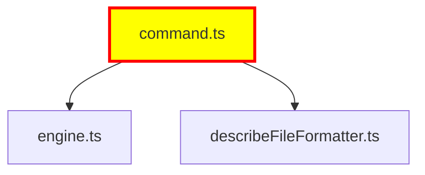

# @mcp-funnel/command-tsci

TypeScript Code Intelligence for MCP Funnel - AI-optimized codebase exploration with minimal token usage.

## Features

- **📋 describe_file** - Get symbols and type information from TypeScript files
- **🔍 describe_symbol** - Deep dive into specific symbols with full type expansion
- **📊 understand_context** - Generate Mermaid diagrams showing file relationships
- **🎯 Token-Efficient** - Minimal output by default (~150-500 tokens vs thousands)
- **⚡ Progressive Disclosure** - Scale from minimal → normal → detailed on demand
- **🔗 Type Expansion** - Inline type signatures for quick understanding
- **🗺️ Dependency Visualization** - Mermaid diagrams for architectural context

## Quick Start

### MCP Protocol (Claude Code, Codex CLI, etc.)

The tsci command is automatically discovered by mcp-funnel. Just use the tools:

```
describe the symbols in src/command.ts
```

Claude will call:
```json
{
  "tool": "describe_file",
  "arguments": {
    "file": "src/command.ts",
    "verbosity": "minimal"
  }
}
```

## MCP Tools

### `describe_file`

Get symbols and type information for a TypeScript file.

**Input:**
```typescript
{
  file: string;              // File path (relative to project root)
  verbosity?: "minimal" | "normal" | "detailed"; // Default: minimal
}
```

**Output (minimal):**
```json
{
  "file": "src/command.ts",
  "symbols": [
    {
      "inline": "class TSCICommand implements ICommand",
      "line": 65
    },
    {
      "inline": "function executeToolViaMCP(toolName: string, args: Record<string, unknown>): Promise<CallToolResult>",
      "line": 150
    }
  ],
  "tokenEstimate": 443
}
```

**Output (normal)** - adds `usages` array:
```json
{
  "file": "src/command.ts",
  "symbols": [
    {
      "inline": "class TSCICommand implements ICommand",
      "line": 65,
      "usages": [
        {
          "file": "src/index.ts",
          "lines": [7],
          "count": 1
        }
      ]
    }
  ],
  "tokenEstimate": 589
}
```

**Output (detailed)** - adds `references` with type previews:
```json
{
  "file": "src/command.ts",
  "symbols": [...],
  "references": [
    {
      "name": "ICommand",
      "kind": "Interface",
      "module": "@mcp-funnel/commands-core",
      "preview": "ICommand ⟶ { name: string; description: string; ... }"
    }
  ],
  "tokenEstimate": 1247
}
```

### `describe_symbol`

Get detailed information about a specific symbol by ID.

**Input:**
```typescript
{
  symbolId: string;          // Symbol ID from describe_file output
  verbosity?: "minimal" | "normal" | "detailed"; // Default: minimal
}
```

**Output:**
```json
{
  "symbol": {
    "id": "TSCICommand:128:src/command.ts:65",
    "name": "TSCICommand",
    "kind": "Class",
    "signature": "class TSCICommand implements ICommand",
    "file": "src/command.ts",
    "line": 65,
    "isExported": true
  },
  "tokenEstimate": 75
}
```

### `understand_context`

Generate Mermaid diagram showing file relationships and dependencies.

**Input:**
```typescript
{
  files: string[];           // Files to include in diagram
  focus?: string;            // Optional file to highlight
}
```

**Output:**


## Verbosity Levels

### Minimal (Default)
- **Symbols**: Name + inline signature + line number
- **Token usage**: ~150-500 tokens per file
- **Best for**: Quick overview, AI context efficiency

### Normal
- **Symbols**: + usage locations (where symbol is used)
- **Token usage**: ~300-800 tokens per file
- **Best for**: Understanding dependencies

### Detailed
- **Symbols**: + external references with type previews
- **Token usage**: ~500-1500 tokens per file
- **Best for**: Deep architectural analysis

## Architecture

### MVP Components

1. **TypeDoc Engine** (`src/core/engine.ts`)
   - Bootstraps TypeDoc application
   - Single-shot project conversion
   - Symbol collection

2. **Symbol Collector** (`src/core/symbolCollector.ts`)
   - Extracts metadata from TypeDoc reflections
   - Generates stable symbol IDs
   - Creates inline type signatures

3. **Symbol Index** (`src/core/symbolIndex.ts`)
   - In-memory index for O(1) lookups
   - Query by file, ID, kind, name
   - Fast symbol retrieval

4. **Type Expander** (`src/services/typeExpander.ts`)
   - Converts TypeDoc types to readable strings
   - Handles: primitives, objects, arrays, unions
   - Cycle detection and depth limits

5. **Formatters** (`src/formatters/`)
   - `DescribeFileFormatter`: File output with verbosity control
   - `DescribeSymbolFormatter`: Symbol output with verbosity control
   - Token estimation for AI context planning

6. **Diagram Generator** (`src/services/diagramGenerator.ts`)
   - Builds dependency graph from symbols
   - Renders as Mermaid syntax
   - Focus highlighting and depth limiting

### SEAMS (Extension Points)

The implementation follows the SEAMS principle - build the socket, not the plug:

```typescript
// Future type formats can be added
interface IDiagramRenderer {
  render(graph: DependencyGraph, options: DiagramOptions): string;
}

// Future formatters can implement this
interface IFormatter<TInput, TOutput> {
  format(data: TInput, options: FormatOptions): TOutput;
}

// Future expanders can be added
interface IExpansionStrategy {
  expand(type: Type, context: ExpansionContext): ExpansionResult;
}
```

**Phase 2 possibilities** (not implemented yet):
- SQLite storage for caching and persistence
- Advanced type expanders (generics, conditional, mapped types)
- Function type expansion
- Watch mode for continuous analysis
- Code metrics and smell detection
- Specialized extractors (Zod, Drizzle, decorators)

## Configuration

The command requires a `tsconfig.json` in the project root or parent directories. It will automatically discover and use it.

**Dependencies:**
- `typedoc@^0.28.13` - TypeScript documentation generator
- `typescript@^5.9.2` - TypeScript compiler

## Token Usage Guidelines

Use **minimal** by default for maximum token efficiency:
- Exploring a codebase: `describe_file` with minimal
- Understanding relationships: `understand_context`
- Need usage info: `describe_file` with normal
- Deep architectural analysis: `describe_file` with detailed

## Development

### Building

```bash
yarn build
```

### Testing

```bash
# Manual test script
npx tsx test-manual.ts

# Validation
npx tsx ../../mcp/src/cli.ts run ts-validate src --compact
```

## Examples

### Example 1: Quick file overview
```
AI: describe src/command.ts with minimal verbosity
→ Returns: 25 symbols, ~443 tokens
```

### Example 2: Understanding dependencies
```
AI: show me how command.ts, engine.ts, and formatters relate
→ Returns: Mermaid diagram with import relationships
```

### Example 3: Deep symbol analysis
```
AI: describe the TSCICommand class in detail
→ Returns: Full symbol info with all usages and references
```

## Comparison with Traditional Approaches

| Approach | Token Usage | Symbol Coverage | Type Info |
|----------|-------------|-----------------|-----------|
| Read file directly | 2000-5000 | Full source | None |
| describe_file (minimal) | 150-500 | Symbols only | Inline |
| describe_file (normal) | 300-800 | Symbols + usages | Inline |
| describe_file (detailed) | 500-1500 | Symbols + refs | Expanded |

**Token savings**: 75-90% vs reading files directly

## Limitations

Current MVP limitations (by design):
- **No persistence**: In-memory only, project is analyzed on first tool call
- **No watch mode**: Single-shot analysis
- **Basic type expansion**: Primitives, objects, arrays, unions only
- **No advanced types**: Generics, conditional types, mapped types fall back to `toString()`
- **File-level granularity**: Cannot query symbols across entire project in one call

## License

MIT

## See Also

- [vitest command](../vitest/README.md) - Test runner with AI-optimized output
- [ts-validate command](../ts-validate/README.md) - TypeScript/ESLint/Prettier validation
- [js-debugger command](../js-debugger/README.md) - Node.js debugger with CDP integration
